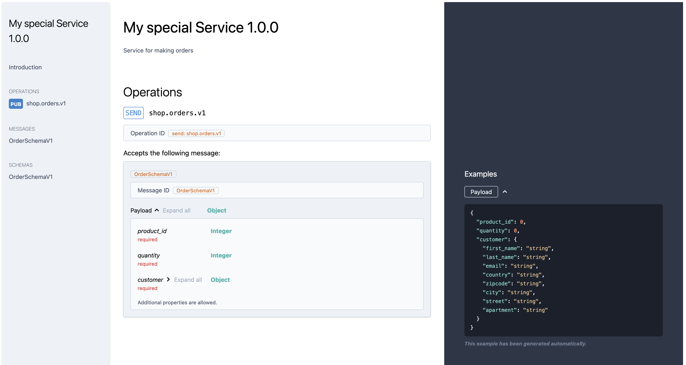

# SimpleSpec


```{eval-rst}
.. automodule:: asyncapi_container.containers.v3.simple_spec
    :members:


```


Define pydantic model and include it inside a list `sends` or `receives`

```python

from asyncapi_container.asyncapi.spec.v3.info import Info
from asyncapi_container.containers.v3.simple_spec import SimpleSpecV3
from asyncapi_container.custom_types import RoutingMap
from pydantic import BaseModel, Field


class Customer(BaseModel):
    first_name: str = Field(..., title='First Name')
    last_name: str = Field(..., title='Last Name')
    email: str = Field(..., title='Email')
    country: str = Field(..., title='Country')
    zipcode: str = Field(..., title='Zipcode')
    city: str = Field(..., title='City')
    street: str = Field(..., title='Street')
    apartment: str = Field(..., title='Apartment')


class OrderSchemaV1(BaseModel):
    product_id: int = Field(..., title='Product Id')
    quantity: int = Field(..., title='Quantity')
    customer: Customer


class MySpecialServiceAsyncAPISpecV3(SimpleSpecV3):
    info: Info = Info(
        title="My special Service",
        version="1.0.0",
        description="Service for making orders"
    )
    sends: RoutingMap = {
        "shop.orders.v1": [
            OrderSchemaV1,
        ]
    }
    receives: RoutingMap = {}

```

Result:


test

```{eval-rst}
.. autoattrs:: django_asyncapi.settings.DjangoAsyncapiSettings
    :members:


```